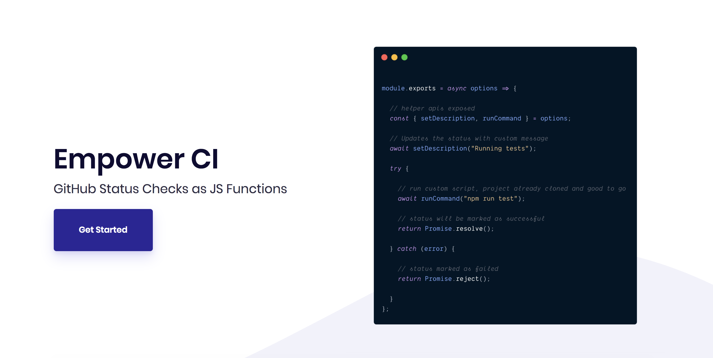

<h2>status-checks: GitHub status checks as JS functions.</h1>

Quickly get setup and integrate with <a href="https://help.github.com/en/articles/about-status-checks" target="_blank">GitHub status checks</a>.
You provide the functions and we will do the rest.

  

[![MIT License][license-badge]][license]
[![PRs Welcome][prs-badge]][prs]

[![Watch on GitHub][github-watch-badge]][github-watch]
[![Star on GitHub][github-star-badge]][github-star]
[![Tweet][twitter-badge]][twitter]

[Donate ☕](https://www.paypal.me/boyney123/5)

  <h3>Features: GitHub integration, functions, docker support, exposed GitHub API helpers, setup within minutes, easily host and more...</h2>
  
  [Read the Docs](https://status-checks.netlify.com/) | [Edit the Docs](https://github.com/boyney123/status-checks)

## The problem

Code quality is important. To help with code quality we have various tasks / scripts / apps and bots that we need to run to assert our quality does not drop.

Continuous integration is a great way to make sure our quality does not drop and we have confidence with our software.

GitHub have done a great job allowing us to integrate with the platform and run various checks before code gets merged. You can automate these checks with GitHub using status checks and GitHub actions.

In the past I have setup multiple projects with GitHub to integrate and run various commands through status checks, and I wanted to create an application that could handle most the integration for me. I wanted to create a platform that allowed me to specify the functions I want to run on each status check.

This is when `status-checks` was born. `status-checks` takes a folder of functions (defined by you) and runs them through any pull request that comes in and integrated back with GitHub.

[You can read the documentation on how to get started](https://status-checks.netlify.com/docs/how-it-works).

## This solution

`status-checks` was built and designed to help developers integrate with GitHub status checks easier. You define the functions to run and this project will do the rest.

## Documentation

- [Getting Started](https://status-checks.netlify.com/docs/getting-started/installation)
- [Contributing](https://status-checks.netlify.com/docs/contributing/contributing)

:star: Huge thanks to the [all-contributors project](https://allcontributors.org/) for allowing us to use their theme for the documentation website. :star:

## Tools

- [@octokit/rest](https://github.com/octokit/rest.js)
- [@octokit/webhooks](https://github.com/octokit/webhooks.js)

### Testing

- [jest](https://jestjs.io/)

## Contributing

If you have any questions, features or issues please raise any issue or pull requests you like.

[spectrum-badge]: https://withspectrum.github.io/badge/badge.svg
[spectrum]: https://spectrum.chat/explore-tech
[license-badge]: https://img.shields.io/github/license/boyney123/status-checks.svg
[license]: https://github.com/boyney123/status-checks/blob/master/LICENSE
[prs-badge]: https://img.shields.io/badge/PRs-welcome-brightgreen.svg?style=flat-square
[prs]: http://makeastatus-checksuest.com
[github-watch-badge]: https://img.shields.io/github/watchers/boyney123/status-checks.svg?style=social
[github-watch]: https://github.com/boyney123/status-checks/watchers
[twitter]: https://twitter.com/intent/tweet?text=Check%20out%20status-checks%20by%20%40boyney123%20https%3A%2F%2Fgithub.com%2Fboyney123%2Fstatus-checks%20%F0%9F%91%8D
[twitter-badge]: https://img.shields.io/twitter/url/https/github.com/boyney123/status-checks.svg?style=social
[github-star-badge]: https://img.shields.io/github/stars/boyney123/status-checks.svg?style=social
[github-star]: https://github.com/boyney123/status-checks/stargazers

# Donating

If you find this tool useful, feel free to buy me a ☕ 👍

[Buy a drink](https://www.paypal.me/boyney123/5)

# License

MIT.
